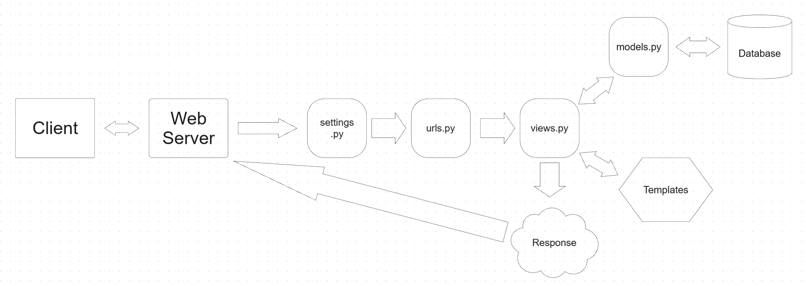
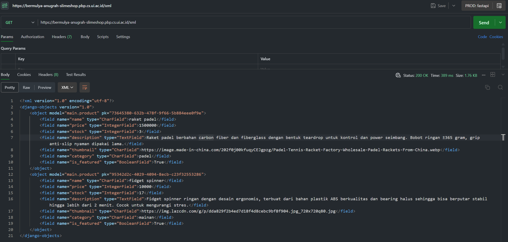
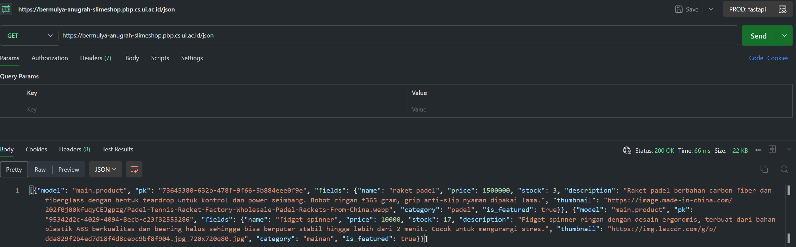
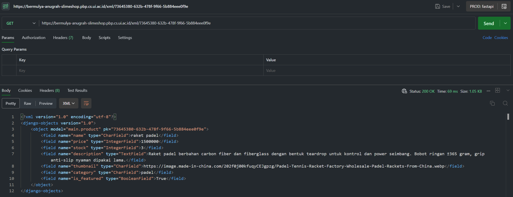
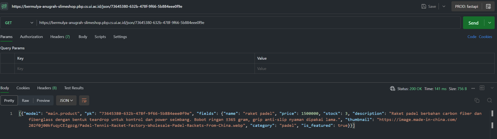

### Repo: https://github.com/mugmold/slime-shop
### Web: https://bermulya-anugrah-slimeshop.pbp.cs.ui.ac.id

---

# "Jelaskan bagaimana cara kamu mengimplementasikan checklist di atas secara step-by-step (bukan hanya sekadar mengikuti tutorial)."

### 1. Membuat project Django baru
Pertama saya membuat sebuah project Django bernama slime_shop dengan perintah ```django-admin startproject slime_shop.```

Setelah project utama selesai dibuat, saya menambahkan sebuah app baru bernama main dengan perintah ```python manage.py startapp main.```

### 2. Setup environment & project awal
Saya membuat file ```.env``` dan ```.env.prod``` untuk menyimpan variable penting (misalnya konfigurasi database).

Saya juga membuat file ```requirements.txt``` untuk setup dependencies agar nantinya bisa dikelola dan digunakan dengan baik serta mudah di-install di environment lain.

Saya juga menambahkan file ```.gitignore``` agar file yang tidak penting (seperti cache, migrations, dll.) tidak ikut di push ke repository.

### 3. Konfigurasi settings.py
Saya mengedit ```settings.py``` pada project ```slime_shop``` untuk mengatur konfigurasi database sesuai dengan arahan tutorial sebelumnya (edit database, tambahkan variable ```PRODUCTION```, dll.).

Pada tahap akhir, setelah deploy ke ```PWS```, saya juga menambahkan domain ```PWS``` ke dalam ```ALLOWED_HOSTS``` agar aplikasi bisa di host di pws, dan juga bisa diakses oleh publik.

### 4. Setup URL
Pada ```slime_shop/urls.py```, saya menambahkan route agar bisa terhubung dengan app main.

Di dalam ```main/urls.py```, saya mendefinisikan path yang menghubungkan URL ke fungsi ```home_page```. Dari sini juga saya sambungkan dengan template HTML (ex: ```home.html```) untuk menampilkan frontend.

### 5. Membuat view dan template
Pada ```main/views.py```, saya membuat fungsi ```home_page``` untuk menampilkan home page awal.

Home page tersebut berisi nama toko saya, serta informasi identitas pribadi (nama dan kelas).

Fungsi ```home_page``` ini kemudian dihubungkan ke template HTML (```home.html```) yang sudah saya buat.

### 6. Membuat model
Pada ```main/models.py```, saya membuat sebuah model Django bernama Product, yang memiliki atribut yang sesuai dengan kebutuhan Tugas1 dan menambahkan atribut ```stock``` untuk menampilkan stock product saat ini, serta juga menambahkan sedikit validator untuk ```price``` dan ```stock``` agar tidak memiliki value negatif.

Model ini kemudian akan digunakan untuk mengelola data yang tersimpan di database.

### 7. Setup Git dan Deploy ke PWS
Saya inisialisasi Git repository, lalu push project ke ```PWS```.

Setelah itu saya deploy aplikasi ke ```GitHub```.

Setelah memastikan aplikasi berhasil jalan, saya melakukan penyesuaian terakhir pada ```settings.py``` (menambahkan ```ALLOWED_HOSTS```), lalu push ulang ke ```GitHub``` dan ```PWS``` agar update-nya ter-deploy.

### 8. Membuat README.md
Terakhir, saya membuat file ```README.md``` yang berisi dokumentasi proyek, termasuk link menuju repository ```GitHub``` dan link aplikasi ```PWS```, serta jawaban dari pertanyaan yang diberikan.

Setelah selesai, saya push ulang project agar ```README.md``` ikut tersimpan di repository.

---

# "Buatlah bagan yang berisi request client ke web aplikasi berbasis Django beserta responnya dan jelaskan pada bagan tersebut kaitan antara ```urls.py```, ```views.py```, ```models.py```, dan berkas ```html```."




### alur request–response pada web aplikasi Django (secara sederhana, sesuai pemahaman saya):
### 1. Client (Browser/User)
-> mengirim request, misalnya mengetik URL ```https://bermulya-anugrah-slimeshop.pbp.cs.ui.ac.id``` di web browser

### 2. ```urls.py``` (URL Dispatcher)
-> Django menerima request serta mengecek pola URL dgn yang ada di file ```urls.py``` untuk mencari kecocokan

### 3. ```views.py``` (View Function/Class)
-> fungsi view yang sesuai akan dijalankan. View bisa memproses data request, memanggil model, atau langsung menyiapkan response yang nantinya akan diberikan kepada user

### 4. ```models.py``` (Database model)
-> jika view butuh data dari database, maka view akan memanggil database model untuk query/insert/update data

### 5. Template HTML (frontend)
-> view kemudian merender data ke dalam file HTML menggunakan template engine Django
(```Note```: Asumsi disini adalah server mengirimkan response berupa ```HTML```)

### 6. Response ke Client
-> HTML serta data tambahan yang sudah jadi dikirim kembali ke browser untuk ditampilkan ke user

---

# "Jelaskan peran ```settings.py``` dalam proyek Django!"

```settings.py``` berperan sebagai pusat konfigurasi proyek Django. File ini menyimpan semua pengaturan penting seperti konfigurasi database, daftar aplikasi yang digunakan,, template, pengaturan keamanan (secret key, debug mode), daftar host yang diizinkan, dll. Dengan adanya ```settings.py```, semua aspek proyek bisa diatur secara terpusat sehingga mudah dikelola dan disesuaikan dengan environment yang ada.

---

# "Bagaimana cara kerja migrasi database di Django?"

Migrasi di Django adalah mekanisme untuk menerapkan perubahan pada model ke dalam database secara otomatis. Prosesnya bekerja dalam dua tahap utama:

1. Saat kita menjalankan ```python manage.py makemigrations```, Django membaca perubahan yang ada di ```models.py``` dan membuat file migrasi (semacam blueprint perubahan database).
2. Lalu dengan ```python manage.py migrate```, Django mengeksekusi file migrasi tersebut ke database, misalnya membuat tabel baru, menambah kolom, atau mengubah struktur tabel.

---

# "Menurut Anda, dari semua framework yang ada, mengapa framework Django dijadikan permulaan pembelajaran pengembangan perangkat lunak?"

Django sering dijadikan framework pertama dalam pembelajaran pengembangan perangkat lunak karena sifatnya yang ```“batteries included”```, yang artinya sudah menyediakan banyak fitur bawaan seperti autentikasi user, sistem admin, ORM untuk menghubungkan aplikasi dengan database, serta struktur proyek yang rapi dan terstandarisasi. Hal ini membuat pemula tidak perlu membangun semuanya dari nol, sehingga bisa lebih cepat membuat aplikasi web dengan mudah. Selain itu, dokumentasinya lengkap, komunitasnya besar, dan banyak digunakan di industri nyata, sehingga belajar Django tidak hanya mempermudah pemahaman dasar konsep web development, tetapi juga relevan untuk kebutuhan professional.

---

# "Apakah ada feedback untuk asisten dosen tutorial 1 yang telah kamu kerjakan sebelumnya?"

Untuk tutorial 1, saya tidak memiliki saran khusus karena menurut saya semua sudah disampaikan dengan baik dan jelas. Penjelasan serta arahan yang diberikan sudah sangat membantu dalam memahami materi, sehingga tidak ada saya tidak memiliki kritik/saran yang dapat disampaikan.

---

# "Jelaskan mengapa kita memerlukan data delivery dalam pengimplementasian sebuah platform?"

Data delivery diperlukan dalam pengimplementasian sebuah platform karena berfungsi memastikan informasi yang disampaikan antar komponen sistem maupun dengan layanan eksternal berjalan dengan aman, cepat, dan konsisten. Tanpa mekanisme pengiriman data yang baik, platform tidak dapat mendukung integrasi, menjaga keandalan informasi, maupun memberikan pengalaman pengguna yang lancar.

---

# "Menurutmu, mana yang lebih baik antara XML dan JSON? Mengapa JSON lebih populer dibandingkan XML?"

Menurut saya, JSON lebih baik dibandingkan XML dalam banyak kasus karena strukturnya lebih sederhana, ringan, dan mudah dibaca manusia maupun diproses oleh mesin. JSON menggunakan format berbasis objek yang langsung sesuai dengan struktur data di banyak bahasa pemrograman, sehingga lebih efisien untuk pertukaran data. Sementara itu, XML cenderung lebih verbose dengan banyak tag tambahan yang membuat ukuran data lebih besar. JSON lebih populer dibandingkan XML karena kecepatan parsing yang lebih tinggi, dukungan luas di API modern, serta kemudahannya digunakan pada aplikasi web dan mobile yang membutuhkan komunikasi cepat dan ringkas.

---

# "Jelaskan fungsi dari method ```is_valid()``` pada form Django dan mengapa kita membutuhkan method tersebut?"

Method ```is_valid()``` pada form Django berfungsi untuk memeriksa apakah data yang dikirim melalui form sesuai dengan aturan validasi yang telah ditentukan, baik itu validasi bawaan (seperti tipe data, panjang karakter, required field) maupun validasi kustom yang kita definisikan sendiri. Jika data valid, method ini akan mengembalikan nilai True dan menyimpan data yang sudah dibersihkan di atribut ```cleaned_data```; jika tidak valid, maka mengembalikan False dan menyimpan pesan error di atribut ```errors```. Kita membutuhkan method ini karena tanpa validasi, data yang masuk ke sistem bisa tidak konsisten, salah format, atau bahkan berpotensi menimbulkan bug serta celah keamanan.

---

# "Mengapa kita membutuhkan ```csrf_token``` saat membuat form di Django? Apa yang dapat terjadi jika kita tidak menambahkan ```csrf_token``` pada form Django? Bagaimana hal tersebut dapat dimanfaatkan oleh penyerang?"

Kita membutuhkan ```csrf_token``` saat membuat form di Django untuk melindungi aplikasi dari serangan ```Cross-Site Request Forgery (CSRF)```, yaitu serangan di mana penyerang mencoba membuat pengguna yang sudah login melakukan aksi tanpa sadar (misalnya mengirim form atau melakukan transaksi) melalui permintaan palsu. Jika ```csrf_token``` tidak ditambahkan, form menjadi rentan karena server tidak bisa membedakan antara permintaan sah dari pengguna dan permintaan berbahaya dari situs lain. Penyerang bisa memanfaatkannya dengan menyisipkan form tersembunyi atau link berbahaya. Ketika korban mengaksesnya, browser akan otomatis mengirim cookie sesi korban ke server, sehingga aksi berbahaya dapat dieksekusi seolah-olah dilakukan oleh korban sendiri.

---

# "Jelaskan bagaimana cara kamu mengimplementasikan checklist di atas secara step-by-step (bukan hanya sekadar mengikuti tutorial)."

Pertama, saya memperbarui model ```Product``` dengan menambahkan primary key ```id``` berupa UUID agar setiap produk memiliki identitas unik yang tidak mudah ditebak. Setelah itu, saya membuat sebuah ```ProductForm``` yang nantinya digunakan sebagai form input saat menambahkan produk baru ke dalam sistem. Form ini kemudian dihubungkan dengan template ```create_product.html``` supaya pengguna bisa mengisi data produk ketika ingin menambahkan produk. Selanjutnya, saya mengedit ```home.html``` agar dapat menampilkan daftar semua produk yang tersimpan beserta informasi pentingnya, lalu menambahkan ```product_detail.html``` untuk menampilkan detail lengkap dari sebuah produk tertentu. Selain itu, saya menambahkan fungsi pada ```views.py``` untuk menangani proses pembuatan produk baru serta fungsi lain untuk menyajikan data produk dalam format ```JSON``` maupun ```XML``` sehingga lebih fleksibel jika data ingin diakses sebagai ```API```. Demi keamanan, saya menambahkan pengaturan ```CSRF_TRUSTED_ORIGINS``` agar form hanya menerima input dari sumber tepercaya dan tidak mudah dieksploitasi penyerang. Terakhir, saya membuat template utama ```base.html``` sebagai kerangka dasar agar semua halaman memiliki struktur yang konsisten dan lebih mudah dikelola.

---

# "Apakah ada feedback untuk asdos di tutorial 2 yang sudah kalian kerjakan?"

Tidak ada feedback khusus untuk asdos di tutorial 2 karena semuanya sudah dijelaskan dengan jelas dan baik, sehingga tidak ada saran tambahan.

---

# Screenshot tugas 2



